# 🧬 API Detector de Mutantes

Este proyecto es una API REST desarrollada en Spring Boot como trabajo práctico integrador, implementando la lógica para el desafío de detección de mutantes de MercadoLibre.

---

## Información del Alumno

* **Estudiante:** Nicolás Vera
* **Legajo:** 51146
* **Materia:** Desarrollo de Software
* **Año:** 3er Año

---

## Descripción del Proyecto

La API cumple con los tres niveles del desafío:
1.  **Nivel 1:** Un algoritmo optimizado ($O(N^2)$) para detectar más de una secuencia de ADN mutante (horizontal, vertical u oblicua).
2.  **Nivel 2:** Exposición de la lógica a través de endpoints REST (`/mutant` y `/stats`) y documentación con Swagger.
3.  **Nivel 3:** Persistencia en base de datos H2, deduplicación de registros usando Hash (SHA-256) y una cobertura de tests superior al 90%.

---

## Arquitectura y Tecnologías Clave

El proyecto está construido siguiendo una arquitectura de 6 capas, separando responsabilidades:

* **`config`**: Configuración de Beans (ej: SwaggerConfig).
* **`controller`**: Recibe las peticiones HTTP (ej: MutantController).
* **`service`**: Contiene toda la lógica de negocio (ej: MutantService, StatsService).
* **`repository`**: Define la interfaz con la base de datos (ej: DnaRecordRepository).
* **`entity`**: Modela las tablas de la base de datos (ej: DnaRecord).
* **`dto`**: Define los objetos de transferencia de datos (JSON) (ej: DnaRequest, StatsResponse).
* **`exception`**: Manejo centralizado de errores (ej: GlobalExceptionHandler).
* **`validation`**: Lógica de validación personalizada (ej: ValidDnaSequenceValidator).

### Docker
El proyecto incluye un `Dockerfile` que empaqueta la aplicación en un contenedor liviano listo para producción. Utiliza un **multi-stage build**, compilando el proyecto en una imagen con JDK 21 y luego copiando el `.jar` final a una imagen limpia de `eclipse-temurin:21-jre-alpine`.

**Para construir la imagen de Docker:**
docker build -t mutant-api .


**Para correr el contenedor:**
docker run -p 8080:8080 mutant-api

### PlantUML Diagrama de Arquitectura
Esta herramienta fue utilizada para diseñar y documentar la arquitectura del proyecto:

```plantuml
@startuml
autonumber
skinparam style strictuml
skinparam sequenceMessageAlign center

actor Cliente as "Cliente (API)"
participant Controller as "API Controllers"
participant Service as "Business Services"
participant Detector as "MutantDetector"
participant Repo as "DnaRecordRepository"
database DB as "H2 Database"

box "Lógica de Aplicación" #LightBlue
 participant Controller
 participant Service
 participant Detector
end box

== 1. Detección de Mutantes (POST /mutant) ==
Cliente -> Controller: POST /mutant {dna: [...]}
activate Controller
Controller -> Service: analyzeDna(dna)
activate Service
Service -> Service: calculateDnaHash(dna)
Service -> Repo: findByDnaHash(hash)
activate Repo
Repo -> DB: SELECT * WHERE hash = ?
activate DB
DB --> Repo: Resultado (Optional)
deactivate DB
Repo --> Service: Optional
deactivate Repo

alt #LightGreen ADN ya analizado (Caché Hit)
 Service --> Controller: Retorna resultado guardado (boolean)
else #LightYellow ADN Nuevo (Caché Miss)
 Service -> Detector: isMutant(dna)
 activate Detector
 Detector --> Service: boolean (true/false)
 deactivate Detector

 Service -> Repo: save(DnaRecord)
 activate Repo
 Repo -> DB: INSERT INTO dna_records...
 activate DB
 DB --> Repo: OK
 deactivate DB
 Repo --> Service: Saved Record
 deactivate Repo

 Service --> Controller: Retorna resultado actual
end

alt Es Mutante
 Controller --> Cliente: 200 OK
else Es Humano
 Controller --> Cliente: 403 Forbidden
end
deactivate Service
deactivate Controller

== 2. Consultar Estadísticas (GET /stats) ==
note right of Cliente: Opción: ?dateStart=...&dateEnd=...

Cliente -> Controller: GET /stats
activate Controller
Controller -> Service: getStats(fechas...)
activate Service

alt #LightCyan Sin Filtros (Histórico)
    Service -> Repo: countByIsMutant(true)
    activate Repo
    Repo --> Service: countMutant
    deactivate Repo
    Service -> Repo: countByIsMutant(false)
    activate Repo
    Repo --> Service: countHuman
    deactivate Repo
else #LightYellow Con Rango de Fechas
    Service -> Repo: countBy...Between(true, start, end)
    activate Repo
    Repo -> DB: SELECT COUNT... WHERE date BETWEEN...
    activate DB
    DB --> Repo: long
    deactivate DB
    Repo --> Service: countMutant
    deactivate Repo

    Service -> Repo: countBy...Between(false, start, end)
    activate Repo
    Repo -> DB: SELECT COUNT... WHERE date BETWEEN...
    activate DB
    DB --> Repo: long
    deactivate DB
    Repo --> Service: countHuman
    deactivate Repo
end

Service -> Service: Calcular Ratio
Service --> Controller: StatsResponse
deactivate Service
Controller --> Cliente: 200 OK {JSON}
deactivate Controller

== 3. Eliminar Registro (DELETE /mutant) ==
Cliente -> Controller: DELETE /mutant {dna: [...]}
activate Controller
Controller -> Service: deleteDnaRecord(dna)
activate Service
Service -> Service: calculateDnaHash(dna)
Service -> Repo: deleteByDnaHash(hash)
activate Repo
Repo -> DB: DELETE FROM ... WHERE hash = ?
activate DB
DB --> Repo: int (filas borradas)
deactivate DB
Repo --> Service: long deletedCount
deactivate Repo

Service --> Controller: void
deactivate Service
Controller --> Cliente: 204 No Content
deactivate Controller

== 4. Health Check (GET /health) ==
Cliente -> Controller: GET /health
activate Controller
Controller --> Cliente: 200 OK {status: "UP", ...}
deactivate Controller

@enduml
```



---

## 🚀 Cómo Ejecutar (Instrucciones)

### Requisitos Previos
* Tener instalado **Java JDK 17 o superior** (el proyecto fue desarrollado y probado con JDK 21).

### 1. Clonar el Repositorio
git clone https://github.com/nicofede2509/integrador-Desarrollo-de-Software-Nicol-s-Vera.git cd ExamenMercado


### 2. Ejecutar la Aplicación
El proyecto incluye un Gradle Wrapper, por lo que no necesitás tener Gradle instalado.

**En Windows (PowerShell):**
.\gradlew.bat bootRun

**En Mac/Linux:**
./gradlew bootRun

La aplicación estará corriendo en `http://localhost:8080`.

### 3. Ejecutar los Tests
Para correr la suite completa de 32 tests (unitarios y de integración) y verificar la cobertura de código:

**En Windows (PowerShell):**
.\gradlew.bat clean test

**En Mac/Linux:**
./gradlew clean test

Si el build termina en **`BUILD SUCCESSFUL`**, significa que todos los tests pasaron y la cobertura de JaCoCo fue superior al 80%.

---

## 💻 Uso de la API

Una vez que la aplicación está corriendo, podés acceder a los siguientes recursos:

### 1. Documentación de la API (Swagger)
Para ver todos los endpoints de forma interactiva y probarlos:
* **URL:** `http://localhost:8080/swagger-ui.html` (Link para puerto local)
* **URL:** `https://trabajo-integrador-desarrollo-de-a6l4.onrender.com/swagger-ui/index.html` (Link para página en render, solo cuando esté en deploy)

### 2. Consola de la Base de Datos (H2)
Para ver los registros de ADN que se van guardando en la base de datos en memoria:
* **URL:** `http://localhost:8080/h2-console` (Link para puerto local)
* * **URL:** `https://trabajo-integrador-desarrollo-de-a6l4.onrender.com/h2-console` (Link para página en render, solo cuando esté en deploy)

**Datos de Conexión:**
* **JDBC URL:** `jdbc:h2:mem:testdb`
* **User Name:** `sa`
* **Password:** (dejar vacío)

### 3. Endpoints Principales

#### `POST /mutant`
Analiza una secuencia de ADN.
* **Respuesta `200 OK`:** Si el ADN es mutante.
* **Respuesta `403 Forbidden`:** Si el ADN es humano.
* **Respuesta `400 Bad Request`:** Si el ADN es inválido (no es NxN, caracteres inválidos, etc.).

#### `GET /stats`
Devuelve las estadísticas de los análisis realizados.
* **Respuesta `200 OK`:** Devuelve un JSON con los conteos y el ratio.
```json
{
    "count_human_dna": 0,
    "count_mutant_dna": 0,
    "ratio": 0.0
}